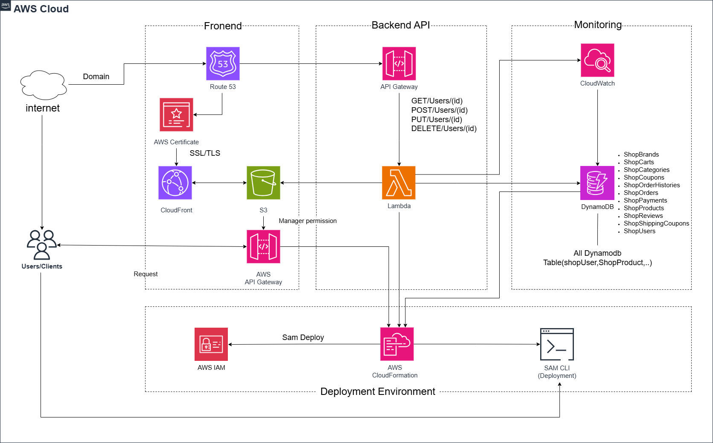

# 📌 Proposal: Xây dựng Website Thương Mại Điện Tử Bán Quần Áo Sử Dụng Dịch Vụ AWS (Kiến Trúc Serverless)

## 👥 Thông Tin Sinh Viên Thực Tập

### 🧑‍🎓 Thành viên 1
- **Họ và tên**: Lê Duy Thuận  
- **Trường**: Đại học Công Nghệ TP.HCM (HUTECH)  
- **MSSV**: 2180603023  
- **Email**: duythuan.pt3107@gmail.com  
- **GitHub**: [thuan120710](https://github.com/thuan120710)  
- **Link Workshop**: [https://thuananwork.github.io/](https://thuananwork.github.io/)

Thông Tin Sinh Viên Thực Tập 2
### 🧑‍🎓 Thành viên 2
- **Họ và tên**: Nguyễn Thuận An
- **Trường**: Đại học Công Nghệ TP.HCM (HUTECH)  
- **MSSV**: 1911256118  
- **Email**: thuanan524@gmail.com 
- **GitHub**: [thuananwork](https://github.com/thuananwork)  
- **Link Workshop**: [https://thuananwork.github.io/](https://thuananwork.github.io/)

## 1. 📄 Executive Summary (10%)

### Problem Statement
Trong bối cảnh thị trường thương mại điện tử ngày càng cạnh tranh gay gắt, các doanh nghiệp nhỏ và cá nhân kinh doanh phải đối mặt với những thách thức lớn về khả năng mở rộng, hiệu suất hệ thống và chi phí vận hành. Các nền tảng truyền thống đòi hỏi đội ngũ kỹ thuật chuyên môn cao và ngân sách lớn để duy trì hạ tầng. Điều này gây cản trở đáng kể cho các đơn vị quy mô nhỏ muốn chuyển đổi số và mở rộng thị trường trực tuyến.

### Success Metrics và Expected Outcomes
- **Success Metrics**:
  - Tốc độ tải trang dưới 5 giây.
  - Tăng trưởng doanh thu tối thiểu 15% trong 12 tháng.
  - Tỷ lệ uptime trên 99.9%.
- **Expected Outcomes**:
  - Hệ thống có khả năng mở rộng linh hoạt theo nhu cầu.
  - Tối ưu chi phí vận hành còn dưới 15 USD/tháng.
  - Cải thiện trải nghiệm người dùng, tăng tỷ lệ chuyển đổi.

### Solution Overview với Key Features
Workshop đề xuất xây dựng một hệ thống thương mại điện tử động dựa trên kiến trúc **AWS Serverless**, tận dụng các dịch vụ như:
- **Amazon S3 + CloudFront**: Lưu trữ và phân phối nội dung tĩnh.
- **API Gateway + AWS Lambda**: Xử lý các yêu cầu backend theo kiến trúc không máy chủ.
- **Amazon DynamoDB**: Lưu trữ dữ liệu với hiệu suất cao và mở rộng tự động.
- **AWS CloudFormation + SAM CLI**: Quản lý hạ tầng bằng mã (Infrastructure as Code).
- **IAM + AWS Certificate Manager**: Đảm bảo bảo mật và phân quyền truy cập.
- **CloudWatch**: Giám sát hiệu suất và ghi log hệ thống.

Các tính năng chính:
- Website tĩnh được phân phối toàn cầu với SSL miễn phí.
- Tích hợp API xử lý sản phẩm, đơn hàng, giỏ hàng.
- Tăng tốc độ phản hồi bằng cache và auto-scaling.
- Hỗ trợ CI/CD triển khai nhanh và rollback an toàn.

### Business Benefits và ROI Summary
- **Business Benefits**:
  - Giảm thiểu chi phí duy trì hạ tầng.
  - Không cần đội DevOps chuyên sâu.
  - Dễ dàng mở rộng và thích ứng với lưu lượng tăng.
- **ROI Summary**:
  - Sử dụng AWS Free Tier giúp giảm chi phí giai đoạn đầu.
  - Dự kiến hoàn vốn trong vòng 6–12 tháng.
  - Tăng trưởng bền vững nhờ nền tảng có thể nhân rộng và bảo trì dễ dàng.

### Investment Required và Timeline
- **Investment Required**:
  - Chi phí gần như bằng 0 cho hạ tầng nhờ AWS Free Tier.
  - Chi phí nhân lực: ~$15/năm cho việc mua tên miền để phân phối toàn cầu.
- **Timeline**:
  - Giai đoạn 1: 1 tuần – Thiết kế kiến trúc hệ thống.
  - Giai đoạn 2: 1 tuần – Phát triển frontend/backend.
  - Giai đoạn 3: 1 tuần – Triển khai tên miền, bảo mật SSL và testing.

**Tổng thời gian:** 3 tuần triển khai + 2 ngày buffer.

## 2. 🎯 Problem Statement

### Current Situation Analysis
Hiện nay, nhiều doanh nghiệp nhỏ vẫn phải duy trì đội ngũ kỹ thuật riêng hoặc thuê ngoài để vận hành hệ thống website thương mại điện tử, dẫn đến chi phí vận hành cao và phụ thuộc lớn vào nguồn lực bên ngoài. Đồng thời, khả năng tự chủ trong việc cập nhật, mở rộng hoặc bảo trì hệ thống là rất hạn chế.

### Pain Points & Quantified Impact
- **Chi phí vận hành cao**: Bao gồm nhân sự kỹ thuật, server vật lý hoặc VPS, chi phí bảo trì.
- **Thiếu khả năng mở rộng linh hoạt**: Hệ thống dễ bị quá tải khi lưu lượng truy cập tăng đột biến.
- **Phụ thuộc vào nhân sự bên ngoài**: Gây chậm trễ trong việc bảo trì, sửa lỗi hoặc cập nhật hệ thống.

### Stakeholders Affected
- **Doanh nghiệp nhỏ**: Gặp khó khăn về chi phí và bảo mật hệ thống.
- **Khách hàng cuối**: Trải nghiệm mua sắm bị ảnh hưởng nếu tốc độ tải chậm hoặc lỗi hệ thống.
- **Nhà phát triển**: Cần nền tảng dễ bảo trì, dễ mở rộng, và bảo mật cao.

### Business Consequences
- Mất khách hàng do trải nghiệm kém.
- Tăng chi phí duy trì lâu dài.
- Rủi ro cao về bảo mật và mất dữ liệu.

### Market Opportunity
Thị trường thương mại điện tử tại Việt Nam và khu vực Đông Nam Á đang tăng trưởng mạnh. Việc ứng dụng kiến trúc serverless giúp các đơn vị nhỏ tận dụng công nghệ hiện đại với chi phí thấp, tốc độ triển khai nhanh và khả năng mở rộng mạnh mẽ. Đây là cơ hội để đổi mới mô hình kinh doanh trực tuyến mà không cần đầu tư lớn ban đầu.

## 3. 🏗️ Solution Architecture

### High-Level Architecture Diagram
*(Sơ đồ kiến trúc hệ thống)*

### AWS Services Selection & Justification
- **Amazon S3**: Lưu trữ nội dung tĩnh (HTML, CSS, JS, hình ảnh).
- **CloudFront**: CDN toàn cầu giúp tăng tốc độ truy cập.
- **API Gateway**: Tạo RESTful API kết nối giữa frontend và backend.
- **AWS Lambda**: Xử lý backend không máy chủ, tự động scale.
- **Amazon DynamoDB**: Lưu trữ dữ liệu NoSQL với độ trễ thấp.
- **AWS CloudFormation**: Quản lý hạ tầng bằng mã (IaC).
- **AWS SAM CLI**: Triển khai các tài nguyên serverless.
- **Route 53**: Quản lý tên miền và DNS.
- **AWS Certificate Manager**: Cấp và quản lý SSL miễn phí.
- **AWS IAM**: Phân quyền truy cập bảo mật cho người dùng và dịch vụ.
- **Amazon CloudWatch**: Theo dõi logs, cảnh báo và đo hiệu suất.

### Component Interactions & Data Flow
1. **Người dùng → Route 53 → CloudFront → S3**: Tải nội dung tĩnh của website.
2. **Người dùng → API Gateway → Lambda → DynamoDB**: Gửi yêu cầu thêm giỏ hàng, đăng ký, thanh toán.
3. **Lambda ↔ DynamoDB**: Lấy/sửa thông tin người dùng, sản phẩm, đơn hàng.
4. **API Gateway + Lambda → CloudWatch**: Ghi log và giám sát hiệu suất.
5. **IAM → API Gateway / Lambda / DynamoDB**: Phân quyền và bảo mật truy cập.
6. **SAM CLI → CloudFormation**: Triển khai toàn bộ kiến trúc hạ tầng từ mã.

### Security Architecture & Compliance
- **IAM Roles/Policies**: Phân quyền chi tiết đến từng dịch vụ.
- **SSL/TLS**: Mã hóa kết nối giữa người dùng và server.
- **Encryption**: Bật mã hóa cho dữ liệu ở trạng thái nghỉ (S3, DynamoDB) và khi truyền đi.

### Scalability & Performance
- **Auto-scaling**: Lambda tự động mở rộng theo lưu lượng truy cập.
- **Load Balancing**: API Gateway điều phối yêu cầu đồng đều.
- **Caching**: CloudFront giảm tải backend, tăng tốc độ phản hồi.

### Integration with Existing Systems
- **OAuth2 (Google)**: Đăng nhập bằng tài khoản Google.
- **Payment Gateway**: Tích hợp các bên thứ ba như Stripe, MoMo, ZaloPay.
- **Webhook/API**: Giao tiếp với hệ thống ERP hoặc quản lý kho hiện tại nếu cần mở rộng.

## 4. 🔧 Technical Implementation

### Implementation Phases with Deliverables
- **Giai đoạn 1: Thiết kế hệ thống và chọn dịch vụ AWS (1 tuần)**
  - Deliverables: Sơ đồ kiến trúc, danh sách dịch vụ AWS được chọn.
- **Giai đoạn 2: Phát triển backend & frontend (1 tuần)**
  - Deliverables: API Gateway, Lambda, DynamoDB, giao diện frontend.
- **Giai đoạn 3: Cấu hình tên miền, SSL và kiểm thử (1 tuần)**
  - Deliverables: Website chạy qua HTTPS với tên miền riêng.

### Technical Requirements
- **Compute**: AWS Lambda (không máy chủ, mở rộng linh hoạt).
- **Storage**: Amazon S3 (tĩnh) và DynamoDB (dữ liệu động).
- **Network**: API Gateway kết nối frontend/backend, CloudFront làm CDN.

### Development Approach & Methodologies
- **Agile**: Phát triển linh hoạt theo sprint.
- **CI/CD Pipeline**: Tự động hóa build, test, deploy qua GitHub + SAM CLI.

### Testing Strategy
- **Unit Testing**: Kiểm thử các hàm Lambda độc lập.
- **Integration Testing**: Kiểm thử giữa các dịch vụ AWS.
- **Performance Testing**: Mô phỏng tải lớn, giám sát bằng CloudWatch.

### Deployment Plan & Rollback Procedures
- **Triển khai**: Dùng SAM CLI và CloudFormation để deploy.
- **Rollback**: Sử dụng CloudFormation Stack rollback hoặc version trước của Lambda.

### Configuration Management
- Quản lý cấu hình qua file `template.yaml` của SAM CLI.
- Theo dõi thay đổi bằng Git (version control).

## 5. 📅 Timeline & Milestones (10%)

### Project Phases Breakdown & Key Milestones
| Giai đoạn  | Thời gian | Deliverables                 | Milestone                    |
| ---------- | --------- | ---------------------------- | ---------------------------- |
| Thiết kế   | 1 tuần    | Kiến trúc & chọn dịch vụ AWS | ✅ Hoàn thành sơ đồ kiến trúc |
| Phát triển | 1 tuần    | Backend, Frontend hoạt động  | ✅ Website chạy với API       |
| Cấu hình   | 1 tuần    | Tên miền, SSL, kiểm thử      | ✅ Truy cập HTTPS hoàn chỉnh  |

### Key Milestones với Success Criteria

- Milestone 1: Hoàn thành thiết kế hệ thống và lựa chọn các dịch vụ AWS.
  - Success Criteria: Kiến trúc hệ thống hoàn chỉnh với các dịch vụ AWS như API Gateway, Lambda, DynamoDB, S3, CloudWatch, Route 53.
  - Dự kiến hoàn thành: Ngày 7 kể từ khi bắt đầu dự án.
- Milestone 2: Phát triển và triển khai backend & frontend lên AWS.
  - Success Criteria: Các Lambda function hoạt động, website trên S3 truy cập được.
  - Dự kiến hoàn thành: Ngày 14.
- Milestone 3: Thiết lập tên miền và bảo mật SSL cho website.
  - Success Criteria: Website hoạt động qua HTTPS và định danh domain thành công.

Dự kiến hoàn thành: Ngày 21.

### Dependencies Identification
- Phụ thuộc vào các dịch vụ AWS (Giai đoạn 2 phụ thuộc vào Giai đoạn 1)
  - Việc phát triển backend và frontend (Giai đoạn 2) phụ thuộc vào việc hoàn thành thiết kế hệ thống và lựa chọn các dịch vụ AWS (Giai đoạn 1), vì hệ thống cần phải có kiến trúc rõ ràng và các dịch vụ AWS đã được xác định để triển khai.
- Backend và Frontend phụ thuộc nhau: 
  - Việc thiết lập tên miền và bảo mật SSL (Giai đoạn 3) phụ thuộc vào việc triển khai hoàn chỉnh hệ thống backend và frontend, vì cần đảm bảo website và API hoạt động trước khi cấu hình tên miền và SSL.

### Critical path analysis
- Giai đoạn 1 (Thiết kế hệ thống và lựa chọn dịch vụ AWS) là bước đầu tiên quan trọng, vì nó quyết định kiến trúc và dịch vụ AWS sử dụng. 
- Giai đoạn 2 (Phát triển backend & frontend) phụ thuộc vào việc hoàn thành giai đoạn 1 để triển khai API, Lambda và frontend. 
- Giai đoạn 3 (Thiết lập tên miền và bảo mật SSL) phụ thuộc vào việc hoàn thành giai đoạn 2, vì cần đảm bảo hệ thống hoạt 

### Resource Allocation plan
- Giai đoạn 1: 2 người (1 frontend, 1 kiến trúc sư).
- Giai đoạn 2: 2 người (1 backend, 1 frontend).
- Giai đoạn 3: 1 người (DevOps).

### Buffer Time cho Risks
- Dự phòng 2 ngày cho các sự cố không mong muốn trong quá trình triển khai (rủi ro về cấu hình, lỗi hệ thống, sự cố mạng).

## 6. 💰 Budget Estimation (10%)

### AWS Infrastructure Costs (Free Tier)
- **S3**: 5 GB miễn phí.
- **Lambda**: 1 triệu requests & 400k GB-sec miễn phí.
- **API Gateway**: 1 triệu requests miễn phí.
- **DynamoDB**: 25 GB miễn phí.
- **CloudFront**: 1 TB miễn phí.
- **CloudWatch**: 5 GB log miễn phí.
- **Route 53**: $0.50/tháng quản lý domain, ~$12-15/năm mua domain.

### Development Costs
- **Nhân lực**: Chi phí nhân sự: Dự án yêu cầu một sinh viên thực tập tham gia phát triển trong 3 tháng. Giả sử mỗi giờ công là $3, với tổng thời gian làm việc là 480 giờ (3 tháng x 160 giờ/tháng), chi phí nhân sự sẽ là:
  - $3 x 480 giờ = $1440
- **Công cụ phát triển**: Không có chi phí phần mềm hoặc phần cứng phát sinh ngoài các dịch vụ AWS Free Tier. Các công cụ như Git, CloudFormation, AWS Console, và các IDE (VSCode, GitHub) đều miễn phí sử dụng.

### Third-Party Services & Licenses
- Third-party Services: Trong phạm vi của dự án này, không yêu cầu bất kỳ dịch vụ bên ngoài nào ngoài AWS.
- Licenses: Không có phí cấp phép phát sinh, vì tất cả các dịch vụ AWS được sử dụng đều nằm trong phạm vi AWS Free Tier hoặc được tính phí theo mức độ sử dụng.
### Operational Costs
- Nếu vượt Free Tier:
  - AWS Lambda: Được miễn phí 1 triệu lượt gọi và 400,000 GB-giây mỗi tháng.  Nếu vượt mức này, chi phí là $0.20 cho mỗi triệu lượt gọi. 
  - Amazon S3: Lưu trữ miễn phí 5 GB mỗi tháng. Sau đó tính phí $0.023/GB/tháng. 
  - API Gateway: Hỗ trợ miễn phí 1 triệu yêu cầu mỗi tháng, vượt giới hạn sẽ tính $3.50 cho mỗi triệu yêu cầu. 
  - DynamoDB: Miễn phí 25 GB lưu trữ và một mức độ đọc/ghi nhất định mỗi tháng. Nếu sử dụng vượt quá sẽ tính $0.25/GB/tháng. 
  - CloudWatch: Được miễn phí 5 GB log mỗi tháng, sau đó tính $0.50/GB log lưu trữ. 
  - CloudFront: Miễn phí 1 TB băng thông mỗi tháng. Sau khi vượt mức, chi phí là $0.085/GB.
  - Route 53: Phí quản lý tên miền khoảng $0.50/tháng cho mỗi domain, chưa kể phí đăng ký tên miền.

### ROI & Break-Even Analysis
- ROI: Dự án dự kiến đạt ROI ~25% trong 6 tháng đầu nhờ tận dụng AWS Free Tier và tự động hóa quy trình, giúp giảm chi phí nhân sự. 
- Break-even: Hệ thống chưa phát sinh chi phí lớn trong 6 tháng đầu. Sau khi vượt mức miễn phí, dự kiến hòa vốn trong vòng 12 tháng nếu mở rộng sử dụng.

### Cost Optimization Strategies
- Tận dụng Free Tier: Sử dụng tối đa các mức miễn phí của AWS trong giai đoạn đầu. 
- Tự động mở rộng (Auto Scaling): Đảm bảo chỉ trả tiền cho tài nguyên thực sự sử dụng. 
- TSử dụng dịch vụ serverless: Chọn Lambda, API Gateway thay vì duy trì server truyền thống để tiết kiệm. 
- Theo dõi và tối ưu định kỳ: Sử dụng CloudWatch để giám sát chi phí, thường xuyên kiểm tra và loại bỏ tài nguyên dư thừa. 
- Chọn vị trí triển khai hợp lý: Lựa chọn khu vực (region) AWS có giá dịch vụ thấp hơn nếu phù hợp.

## 7. ⚠️ Risk Assessment (5%)
### Risk Identification 
- Technical Risks: 
  - Lỗi trong Lambda function gây gián đoạn API 
  - Quản lý quyền IAM sai gây rò rỉ dữ liệu 
  -CloudFormation deploy sai gây hỏng hạ tầng
- Business Risks: 
  - Người dùng không đăng nhập được bằng Google do sai cấu hình OAuth 
  - Chi phí AWS tăng nếu traffic bất ngờ cao
  - Không đáp ứng kỳ vọng trải nghiệm của khách hàng 
- Operational Risks: 
  - Mất kết nối Internet khi demo hoặc triển khai 
  - Thiếu người hỗ trợ kỹ thuật nếu gặp sự cố đột ngột 
  - Sai sót trong quá trình thiết lập Route 53, SSL

### Impact assessment và probability analysis
| Rủi ro                | Ảnh hưởng  | Xác suất   | Mức độ ưu tiên |
| --------------------- | ---------- | ---------- | -------------- |
| Lambda lỗi            | Cao        | Trung bình | 🟥 Cao          |
| IAM sai quyền         | Rất cao    | Thấp       | 🟧 Trung bình   |
| OAuth Google lỗi      | Cao        | Trung bình | 🟥 Cao          |
| CloudFormation lỗi    | Cao        | Thấp       | 🟧 Trung bình   |
| Route 53 cấu hình sai | Trung bình | Trung bình | 🟧 Trung bình   |
| Chi phí vượt giới hạn | Cao        | Thấp       | 🟧 Trung bình   |

### Risk matrix với prioritization
| Tác động \ Xác suất | Cao                                                           | Trung bình                                    | Thấp                                    |
| ------------------- | ------------------------------------------------------------- | --------------------------------------------- | --------------------------------------- |
| **Cao**             | 🟥 Lambda lỗi xử lý API, Google OAuth lỗi đăng nhập            | 🟥 Không nhận SSL gây lỗi bảo mật              | 🟧 Chi phí AWS vượt giới hạn miễn phí    |
| **Trung bình**      | 🟧 Route 53 cấu hình sai gây lỗi domain                        | 🟧 CloudFront cấu hình sai cache hoặc redirect | 🟨 Tăng chi phí AWS nhẹ do truy cập tăng |
| **Thấp**            | 🟨 IAM gán sai quyền cho frontend (hạn chế truy cập chức năng) | 🟨 CloudFormation deploy lỗi nhẹ               | 🟩 Giao diện minor bug                   |

### Mitigation Strategies
- - **Lambda** lỗi  Viết unit test, debug với CloudWatch Logs 
- **IAM sai quyền** Tạo theo policy mẫu, kiểm tra kỹ quyền trước khi deploy 
- **Google OAuth lỗi** Thường xuyên test auth flow ở môi trường staging 
- **CloudFormation lỗi** Dùng YAML chuẩn hóa, test trên environment nhỏ trước Chi phí cao → Giới hạn tài nguyên DynamoDB/S3, theo dõi bằng Budget Alarm 
- **Route 53 lỗi** Hướng dẫn thiết lập chi tiết, backup cấu hình

### Contingency Plans
- Lỗi Lambda: Rollback version.
- OAuth lỗi: Cho phép login thủ công tạm thời.
- Vượt chi phí: Tạm hạn chế traffic / disable CloudFront.
- CloudFormation lỗi: Rollback lại Stack trước đó.

### Monitoring & Escalation
- **CloudWatch Alarm** theo dõi lỗi & chi phí.
- **AWS Budgets** cảnh báo vượt mức chi phí tháng.
- **CI/CD log check** Kiểm tra tự động  sau mỗi lần deploy.
- Quy trình xử lý: Log → Notify → Fix/Rollback → Report
  - Mỗi tuần kiểm tra toàn hệ thống ít nhất 1 lần 
  - Duy trì báo cáo logs định kỳ

## 8. 🎯 Expected Outcomes (5%)

### Success Metrics
**Technical:** 
- Thời gian phản hồi API < 500ms (95% requests) 
- Tỷ lệ uptime hệ thống > 99.9% 
- Hệ thống không lỗi chức năng trong quá trình CI/CD 
- Thời gian deploy mỗi lần < 2 phút 
**Business:**
- Truy cập website > 5.000 lượt/tháng sau 6 tháng 
- Tối ưu chi phí vận hành < 15 USD/tháng nhờ serverless 
- Sẵn sàng scale khi có > 500 đơn hàng/ngày

### Short-Term Benefits
- Website vận hành ổn định với domain và SSL đầy đủ 
- Người dùng có thể đăng nhập bằng Google một cách bảo mật 
- Quản lý sản phẩm, đơn hàng, giỏ hàng trực quan 
- Triển khai CI/CD giúp rút ngắn thời gian phát hành sản phẩm 
- Backend serverless giảm thiểu lỗi và tiết kiệm chi phí đáng kể

### Medium-Term Benefits
- Dễ dàng tích hợp thanh toán online (MoMo, ZaloPay, Stripe, v.v.) 
- Tăng trưởng lượt truy cập và đơn hàng nhờ SEO và tốc độ cao từ CloudFront 
- Có thể mở rộng thêm hệ thống phân tích dữ liệu mua hàng 
- Áp dụng Machine Learning để gợi ý sản phẩm tương tự

### Long-Term Value
- Long-Term Value Sở hữu nền tảng thương mại điện tử hoàn chỉnh, mở rộng đa lĩnh vực 
- Có thể triển khai như một SaaS (bán nền tảng cho nhiều shop) 
- Tích hợp mobile app sử dụng cùng backend AWS hiện tại 
- Xây dựng thương hiệu cá nhân trong lĩnh vực cloud/web

### User Experience Improvements
- Tốc độ tải trang nhanh nhờ CloudFront
- Giao diện dễ dùng, hỗ trợ responsive trên mobile
- Trải nghiệm đăng nhập, mua hàng đơn giản và bảo mật
- Giao diện rõ ràng giúp tăng tỷ lệ chuyển đổi mua hàng

### Strategic Capabilities Gained
- Thành thạo triển khai hạ tầng AWS: Lambda, DynamoDB, CloudFormation 
- Có kiến thức và thực hành thực tế CI/CD, bảo mật hệ thống 
- Khả năng xây dựng full-stack web có khả năng mở rộng lớn 
- Nâng cao kỹ năng teamwork, quản lý dự án thực tế